# 👋 Hello, I'm Ajinkya Bhosale

<div align="center">
  
  
  
  [](https://www.linkedin.com/in/ajinkya--bhosale)
  [](https://x.com/Ajinkya_offical)
  [](mailto:bhosaleajinkya2205@gmail.com)
  [](https://learnwithajinkya.dev)

</div>

---

## 🎯 About Me

```python
class AjinkyaBhosale:
    def __init__(self):
        self.username = "ajinkyainfosec"
        self.role = "Cybersecurity Professional & Developer"
        self.education = "B.E. Computer Science & Engineering"
        self.institution = "Sinhgad Institute of Technology & Science"
        self.location = "Pune, Maharashtra, India"
        self.cgpa = 8.07
        
    def current_focus(self):
        return [
            "Network Security",
            "Web Application Security",
            "OSINT & Threat Intelligence",
            "SIEM Implementation",
            "Secure Application Development"
        ]
    
    def interests(self):
        return [
            "Penetration Testing",
            "Vulnerability Assessment",
            "Security Automation",
            "CTF Challenges",
            "Blue Team Operations"
        ]
```

---

## 🛡️ Security Arsenal

### Cybersecurity Tools
<div align="center">


</div>

### Programming Languages
<div align="center">


</div>

### Web Development
<div align="center">


</div>

### Databases & Cloud
<div align="center">


</div>

---

## 🚀 Featured Projects

### 🔐 [Host-Based Intrusion Detection System (HIDS)](https://github.com/ajinkyainfosec/Host-based-intrusion-detection)
> Python-based web application for monitoring system files, logs, and processes with **95% detection rate**

**Tech Stack:** `Python` `Flask` `SHA-256` `Gmail API` `HTML/CSS`

**Key Features:**
- ✅ Real-time process monitoring
- ✅ File integrity checking using SHA-256
- ✅ Log analysis for suspicious activities
- ✅ Automated email alerts
- ✅ Web dashboard for visualization

---

### 🍯 [Python-Based Honeypot](https://github.com/ajinkyainfosec/basic-honeypot)
> Lightweight honeypot simulating multiple service ports to capture attacker behavior

**Tech Stack:** `Python` `Socket Programming` `Multithreading` `JSON/CSV`

**Key Features:**
- ✅ Multi-port simulation (SSH, FTP, HTTP, HTTPS)
- ✅ IP & behavior tracking
- ✅ Structured logging (JSON/CSV)
- ✅ Real server response mimicry

---

### 📊 [Wazuh SIEM & Vulnerability Monitoring](https://github.com/ajinkyainfosec)
> Enterprise-grade SIEM solution for comprehensive threat detection

**Tech Stack:** `Linux` `Wazuh` `Elasticsearch` `Log Analysis`

**Key Features:**
- ✅ Centralized log collection
- ✅ File integrity monitoring
- ✅ Vulnerability detection
- ✅ Real-time security alerts

---

### 🔑 [Basic Keylogger](https://github.com/ajinkyainfosec/keylogger)
> Educational keylogger built for ethical research purposes

**Tech Stack:** `Python`

**Purpose:** Understanding keystroke capture mechanisms for defensive security

---

### 🍔 Android Food Delivery App
> Full-featured mobile application with real-time order tracking

**Tech Stack:** `Java` `Android Studio` `Firebase` `XML`

**Key Features:**
- ✅ Firebase authentication
- ✅ Real-time order tracking
- ✅ Intuitive UI/UX design
- ✅ Cloud database integration

---

## 📊 GitHub Statistics

<div align="center">
  
  
  
  
  
  

</div>

---


---


## 🎯 Current Learning Path

```mermaid
graph LR
    A[Network Security] --> B[Advanced Pentesting]
    B --> C[Exploit Development]
    C --> D[Malware Analysis]
    D --> E[Threat Hunting]
    E --> F[Security Architecture]
    
    style A fill:#00FF88,stroke:#00FF88,color:#000
    style B fill:#00FF88,stroke:#00FF88,color:#000
    style C fill:#00FF88,stroke:#00FF88,color:#000
    style D fill:#39FF14,stroke:#39FF14,color:#000
    style E fill:#0FF,stroke:#0FF,color:#000
    style F fill:#0FF,stroke:#0FF,color:#000
```

<div align="center">



</div>

**Currently Exploring:**
- 🔍 Advanced Web Application Security
- 🛡️ Cloud Security (AWS, Azure)
- 🤖 AI/ML for Cybersecurity
- 📱 Mobile Application Security
- 🌐 IoT Security
- ⛓️ Blockchain Security

---

## 📈 Contribution Graph

<div align="center">
  
  

</div>

---

## 🎖️ GitHub Trophies

<div align="center">
  
  

</div>

---

## 💡 Fun Facts About Me

<div align="center">

| 🎯 | Fact |
|---|---|
| 🔐 | I can crack basic passwords faster than I can decide what to eat |
| 💻 | My IDE theme is darker than my coffee |
| 🐛 | I've found more bugs than an entomologist |
| 🌙 | Best code is written at 3 AM (allegedly) |
| ☕ | Coffee-to-code ratio: 1:100 lines |
| 🎮 | CTF player - where breaking things is encouraged |

</div>

---

## 📫 Connect With Me

<div align="center">

### Let's collaborate on cybersecurity projects! 🤝

[](mailto:bhosaleajinkya2205@gmail.com)
[](https://www.linkedin.com/in/ajinkya--bhosale)
[](https://x.com/Ajinkya_offical)
[](https://ajinkyabhosale.com)

### 📍 Location: Pune, Maharashtra, India

</div>

---

## 📝 Latest Blog Posts

<!-- BLOG-POST-LIST:START -->
- 🔐 [Building a Custom Honeypot: Lessons Learned](https://your-blog.com)
- 🛡️ [SIEM Implementation Best Practices](https://your-blog.com)
- 🔍 [Web Application Security: Common Vulnerabilities](https://your-blog.com)
- 💻 [Python for Cybersecurity Automation](https://your-blog.com)
<!-- BLOG-POST-LIST:END -->

---

## 🎨 Contribution Insights

```text
🌞 Morning    ████████░░░░░░░░░░░░░   35%
🌆 Daytime    ████████████░░░░░░░░░   45%
🌃 Evening    ████████░░░░░░░░░░░░░   15%
🌙 Night      █████░░░░░░░░░░░░░░░░   05%
```

```text
Monday       ████████████░░░░░░░░░   55%
Tuesday      ███████████░░░░░░░░░░   50%
Wednesday    ████████████░░░░░░░░░   60%
Thursday     ███████████░░░░░░░░░░   50%
Friday       ██████████░░░░░░░░░░░   45%
Saturday     ████████░░░░░░░░░░░░░   35%
Sunday       ██████░░░░░░░░░░░░░░░   25%
```

---

## 🔥 Projects By Category

### 🛡️ Cybersecurity Projects
- [Host-Based Intrusion Detection System](https://github.com/ajinkyainfosec/Host-based-intrusion-detection)
- [Python-Based Honeypot](https://github.com/ajinkyainfosec/basic-honeypot)
- [Keylogger (Educational)](https://github.com/ajinkyainfosec/keylogger)
- Wazuh SIEM Implementation

### 💻 Development Projects
- [Portfolio Website](https://github.com/ajinkyainfosec/learnwithajinkya)
- Android Food Delivery App
- Web Application Security Scanner (Coming Soon)

### 📚 Learning & Research
- Security Tool Development
- Penetration Testing Scripts
- Automation Scripts for Security Tasks

---

<div align="center">

### 💬 Quote of the Day


---

### 📊 Profile Views


---

### ⚡ Quick Stats


---

**🔒 "Hack the Planet, Secure the Future"** 🚀

</div>

---

<div align="center">
  
</div>
